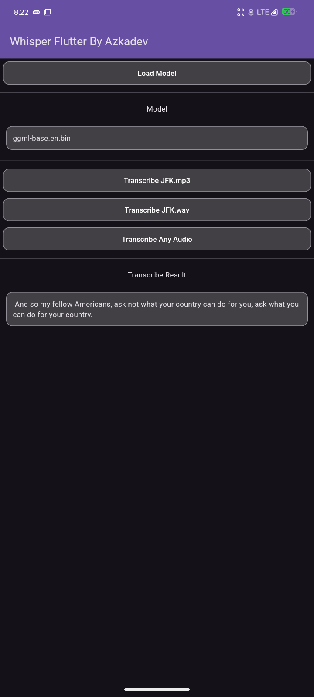
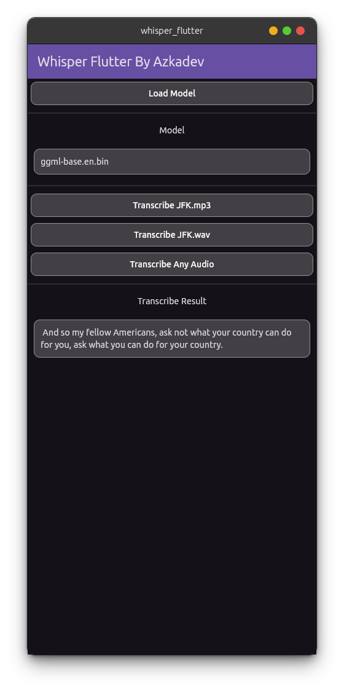

# Whisper Flutter

This is a minimalist open-source application just to demonstrate the use of the library I created [Whisper GPL](https://github.com/azkadev/whisper_gpl).

Trust me, even though there are many Whisper libraries, this one is the easiest to use and fastest. It doesn't require isolating, and it doesn't require converting ffmpeg, as it doesn't require converting to wav by default.

However, keep in mind that Whisper GPL is just an example library, and only a few platforms are supported: Android and Linux.

If you want more, you can check out my GitHub, the creator of Whisper Flutter and Whisper GPL [Azkadev's GitHub](https://github.com/azkadev). You'll need to find the repository; if it's not there, it's not ready yet. You can wait or find another alternative.

## Screenshots

| 1 | 2 |
|--------------------------------|--------------------------------|
|  |  |

## Model Support

Basically, this supports all Whisper models.

## Download Link

Please download it as a zip file, then extract and install it.

- [Android / Linux](https://github.com/azkadev/whisper_flutter/releases/download/app/app.zip)

## Author

- https://github.com/azkadev

## License

MIT