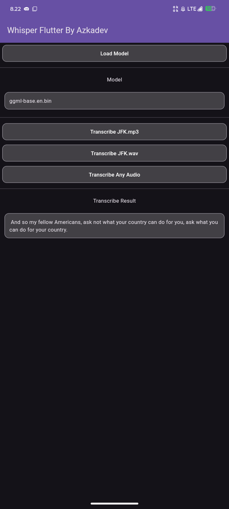

# Whisper Flutter

ini adalah open source applikasi minimalist hanya untuk mencontohkan penggunaan library yang saya buat [Whisper Gpl](https://github.com/azkadev/whisper_gpl).

percayalah walaupun banyak library whisper, library ini yang paling mudah di gunakan dan cepat, tidak perlu isolate, tidak perlu convert ffmpeg, karena secara bawaan sudah tidak perlu convert menjadi wav

namun perlu di ingat karena whisper gpl merupakan library contoh saja platform yang di support hanya sedikit android dan linux,

jika kamu ingin lebih maka kamu bisa check github saya pembuat whisper flutter dan whisper gpl [Github Azkadev](https://github.com/azkadev) kamu perlu mencari repository jika tidak ada berarti belum di siapkan kamu bebas menunggu / cari alternative lain

## Screenshot

| 1                              | 2                              |
|--------------------------------|--------------------------------|
|  |  |

## Model Support

pada dasarnya ini support semua model whisper

https://huggingface.co/ggerganov/whisper.cpp/tree/main

## Link Download

silahkan download itu, berupa file zip lalu ekstrak dan install

- [Android / Linux](https://github.com/azkadev/whisper_flutter/releases/download/app/app.zip)

## Author

- https://github.com/azkadev

## Lisensi

MIT